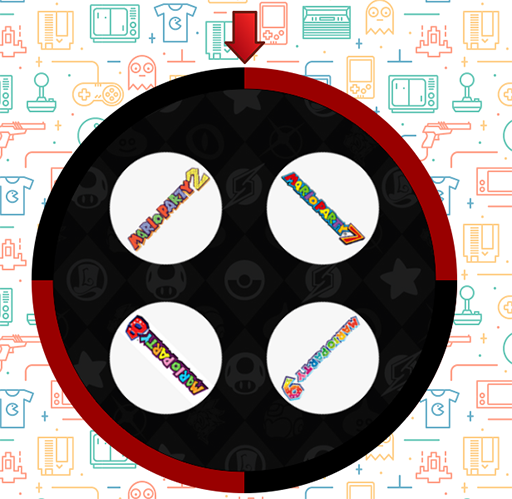

# GameRoulette

A simple yet effective way to settle down video game decisions with your friends.

A roulette made with HTML, CSS and a bit of JS magic. To customize the options, just change the _spinner_ div images. Option images work better if they are 128px x 128px.

Future support is planned for roulettes with 2, 3, 5, 6 and 8 options. 

## Demo

You can check a demo [here](http://mecabotware.com/pruebas/roulette/). Click the roulette to make it spin.

## Screenshots

## Dependencies.

No dependencies are needed to run this project. 

## Installation

To run the project, you can upload it to a web server, or run it in a browser from the file system.

## Questions or issues?

Please feel free to raise an issue in our issue page.

## Disclaimer

I am not the owner of the logos presented here. Trademarks are property of their respective owners. Used here only as a reference.